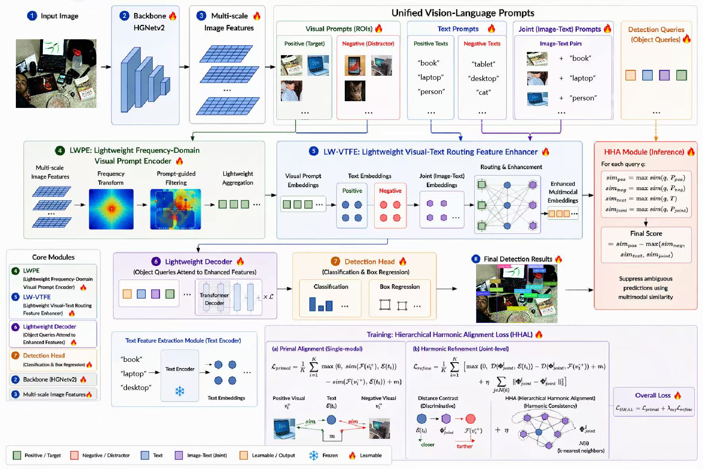

# omni-dfine
Real-time Unified Vision-Language Prompting for Open-Vocabulary Detection


<!--# [Omni-dfine: Real-time Unified Vision-Language Prompting for Open-Vocabulary Detection](https://arxiv.org/abs/xxxxxx) -->

English

<h2 align="center">
  Omni-dfine: Real-time Unified Vision-Language Prompting for Open-Vocabulary Detection
</h2>


<p align="center">
    <a href="https://github.com/luck-research/omni-dfine/blob/main/LICENSE">
        
    </a>
</p>


<p align="center">
    <a href="https://paperswithcode.com/sota/real-time-object-detection-on-coco?p=d-fine-redefine-regression-task-in-detrs-as">
        
    </a>
</p>


<p align="center">
    
</p>

Open-vocabulary object detection aims to localize arbitrary objects specified by text or image prompts beyond a fixed category set. Current SOTA methods, however, exhibit a fundamental trade-off between inference efficiency and cross-domain generalization. YOLO-based architectures (e.g., YOLO-World, YOLOE) achieve real-time speed but lack robustness in open domains, whereas DETR-based counterparts (e.g., Grounding DINO, T-Rex2) offer superior accuracy at the cost of slow inference and complex pre-training, limiting edge deployment. We overcome this trade-off by by introducing Omni-DFINE, a lightweight DETR-based framework that harmonizes speed, accuracy, and generalization. Our approach integrates efficient feature fusion with a redesigned prompt encoder and a novel vision-language contrastive constraint module. This design effectively aligns image and text prompt representations, substantially boosting cross-domain robustness while preserving real-time inference. Trained solely on standard datasets, Omni-DFINE achieves a new Pareto frontier in open-set detection, attaining \textbf{44.5}, \textbf{42.1}, and \textbf{40.1} mAP on COCO for its Base, Small, and Nano variants. Remarkably, the Base model surpasses Grounding DINO 1.5 Edge using only \textbf{0.03\%} of the training data with inference latency under \textbf{30ms} (Nano: \textbf{8ms}). 

<details open>
<summary> Video </summary>

</details>


## Model Zoo

### COCO
| Model | Dataset | AP<sup>val</sup> | #Params | Latency | GFLOPs | config | checkpoint | logs |
| :---: | :---: | :---: |  :---: | :---: | :---: | :---: | :---: | :---: |
**D&#8209;FINE&#8209;N** | COCO | **42.8** | 4M | 2.12ms | 7 | [yml](./configs/dfine/dfine_hgnetv2_n_coco.yml) | [42.8](https://github.com/Peterande/storage/releases/download/dfinev1.0/dfine_n_coco.pth) | [url](https://raw.githubusercontent.com/Peterande/storage/refs/heads/master/logs/coco/dfine_n_coco_log.txt)
**D&#8209;FINE&#8209;S** | COCO | **48.5** | 10M | 3.49ms | 25 | [yml](./configs/dfine/dfine_hgnetv2_s_coco.yml) | [48.5](https://github.com/Peterande/storage/releases/download/dfinev1.0/dfine_s_coco.pth) | [url](https://raw.githubusercontent.com/Peterande/storage/refs/heads/master/logs/coco/dfine_s_coco_log.txt)
**D&#8209;FINE&#8209;M** | COCO | **52.3** | 19M | 5.62ms | 57 | [yml](./configs/dfine/dfine_hgnetv2_m_coco.yml) | [52.3](https://github.com/Peterande/storage/releases/download/dfinev1.0/dfine_m_coco.pth) | [url](https://raw.githubusercontent.com/Peterande/storage/refs/heads/master/logs/coco/dfine_m_coco_log.txt)
**D&#8209;FINE&#8209;L** | COCO | **54.0** | 31M | 8.07ms | 91 | [yml](./configs/dfine/dfine_hgnetv2_l_coco.yml) | [54.0](https://github.com/Peterande/storage/releases/download/dfinev1.0/dfine_l_coco.pth) | [url](https://raw.githubusercontent.com/Peterande/storage/refs/heads/master/logs/coco/dfine_l_coco_log.txt)
**D&#8209;FINE&#8209;X** | COCO | **55.8** | 62M | 12.89ms | 202 | [yml](./configs/dfine/dfine_hgnetv2_x_coco.yml) | [55.8](https://github.com/Peterande/storage/releases/download/dfinev1.0/dfine_x_coco.pth) | [url](https://raw.githubusercontent.com/Peterande/storage/refs/heads/master/logs/coco/dfine_x_coco_log.txt)


## Quick start
## 🛠️ Environment

Please first install following the instructions in the [get_started](https://github.com/open-mmlab/mmdetection/blob/main/docs/en/get_started.md) section, then you need to install additional dependency packages:

```bash
pip install -r requirements/multimodal.txt
pip install emoji ddd-dataset
pip install git+https://github.com/lvis-dataset/lvis-api.git
```

> **Note**: The LVIS third-party library does not currently support numpy >= 1.24. Please ensure your numpy version meets the requirements. It is recommended to install `numpy==1.23`.

## 📂 Data Preparation

### Pretrained Weights

Download the following pretrained models and place them under `pretrained/`:

| Model | Path |
| --- | --- |
| hgnetv2| `pretrained/.pth` |
| BERT | `pretrained/bert-base-uncased/` |
| [MM-Omni-Dfine]() | `will be soon  ` |


For downloading BERT weights, please refer to the [MM-Grounding-DINO usage guide](configs/mm_grounding_dino/usage.md#download-bert-weight).

### Datasets

For detailed data preparation instructions, please refer to the [MM-Grounding-DINO dataset preparation guide](configs/mm_grounding_dino/dataset_prepare.md).

**Training data**: [Objects365v1](configs/mm_grounding_dino/dataset_prepare.md#1-objects365v1)

**Evaluation datasets**:
- [COCO 2017](configs/mm_grounding_dino/dataset_prepare.md#1-coco-2017)
- [LVIS 1.0 (minival)](configs/mm_grounding_dino/dataset_prepare.md#2-lvis-10)
- [ODinW35](configs/mm_grounding_dino/dataset_prepare.md#3-odinw)

The overall data directory structure should look like this:

```text
data/
├── objects365v1/
│   ├── objects365_train.json
│   ├── objects365_val.json
│   ├── o365v1_train_od.json
│   ├── o365v1_label_map.json
│   ├── train/
│   └── val/
├── coco/
│   ├── annotations/
│   │   ├── instances_train2017.json
│   │   ├── instances_val2017.json
│   ├── train2017/
│   └── val2017/
├── lvis/
│   ├── annotations/
│   │   ├── lvis_v1_train.json
│   │   ├── lvis_v1_val.json
│   │   ├── lvis_v1_minival_inserted_image_name.json
│   ├── train2017/
│   └── val2017/
└── odinw/
    ├── AerialMaritimeDrone/
    │   ├── large/
    │   │   ├── test/
    │   │   ├── train/
    │   │   └── valid/
    │   └── tiled/
    ├── AmericanSignLanguageLetters/
    ├── Aquarium/
    └── ...  (35 datasets in total)
```


## Figures and Visualizations

<details>
<summary> Results </summary>


## Citation

</details>

## Acknowledgement
Our work is built upon [D-Fine](https://github.com/Peterande/D-FINE) and [RT-DETR](https://github.com/lyuwenyu/RT-DETR).
Thanks to the inspirations from [RT-DETR](https://github.com/lyuwenyu/RT-DETR), [GFocal](https://github.com/implus/GFocal), [LD](https://github.com/HikariTJU/LD), and [YOLOv9](https://github.com/WongKinYiu/yolov9).

